# 即時聊天室系統 - C4 架構文檔

## 目錄

1. [系統概述](#系統概述)
2. [C1 - 系統上下文](#c1---系統上下文)
3. [C2 - 容器架構](#c2---容器架構)
4. [C3 - 組件架構](#c3---組件架構)
5. [C4 - 程式碼架構](#c4---程式碼架構)
6. [資料流架構](#資料流架構)

---

## 系統概述

**系統名稱**: 即時多人聊天室系統

**系統描述**: 基於 FastAPI + MongoDB + SvelteKit 的即時通訊平台，支援多房間、檔案分享、即時通知等功能。

**技術架構**: 三層架構 + 依賴注入 + 記憶體WebSocket廣播架構

**部署方式**: Docker容器化部署，單實例限制

---

## C1 - 系統上下文

### 系統邊界圖

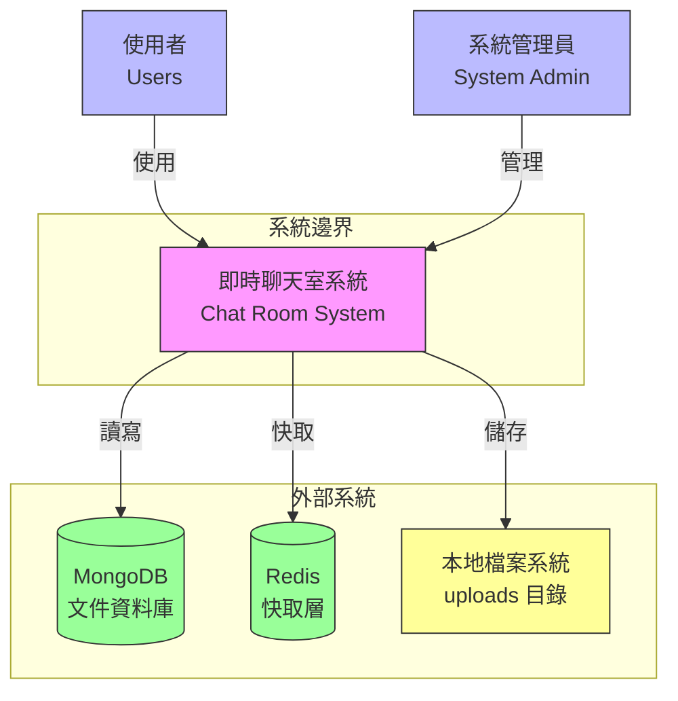

### 關係說明

| 參與者 | 與系統關係 | 通訊協議 | 資料類型 |
|--------|------------|----------|----------|
| **使用者** | 使用聊天功能 | HTTPS, WebSocket | 聊天訊息、檔案 |
| **管理員** | 系統管理、監控 | HTTPS | 管理操作、系統配置 |
| **MongoDB** | 持久化儲存 | TCP/IP | 用戶資料、訊息記錄、房間資料 |
| **Redis** | 快取層 | TCP/IP | 快取資料、速率限制 |
| **檔案儲存** | 本地檔案儲存 | 檔案系統 | 圖片、文件、媒體檔案 |

---

## C2 - 容器架構

### 容器部署圖

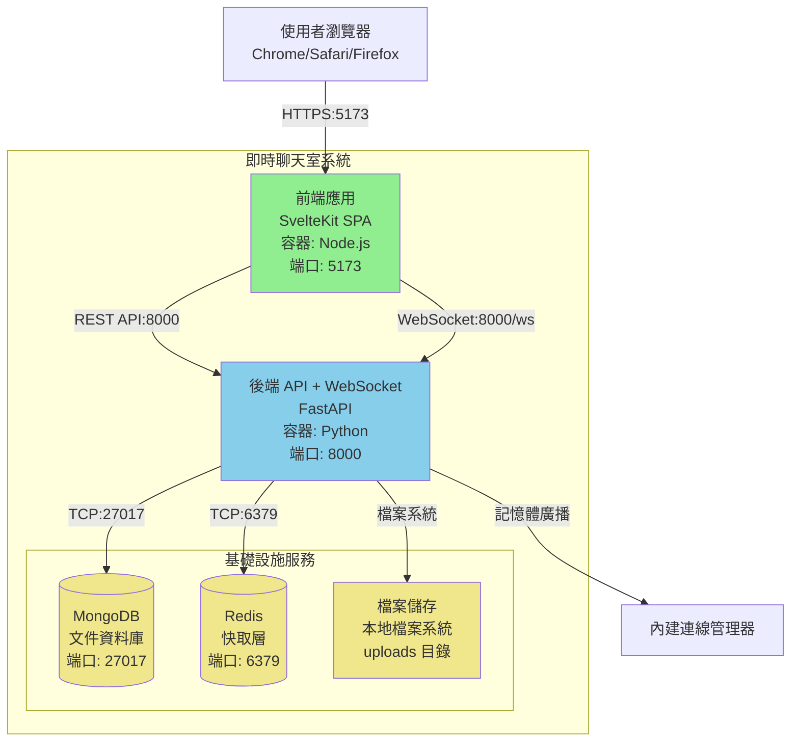

### 容器技術規格

| 容器 | 技術堆疊 | 主要功能 | 擴展性 |
|------|----------|----------|--------|
| **前端** | SvelteKit + TypeScript + DaisyUI | 用戶界面、路由、狀態管理 | 水平擴展 |
| **後端 API + WebSocket** | FastAPI + Python + uvicorn | REST API、WebSocket、業務邏輯 | 單實例（記憶體廣播限制） |
| **MongoDB** | MongoDB | 資料持久化  | 垂直擴展 |
| **Redis** | Redis | 快取層、速率限制  | 垂直擴展 |

---

## C3 - 組件架構

### 3.1 後端 API 組件架構

#### 展示層組件

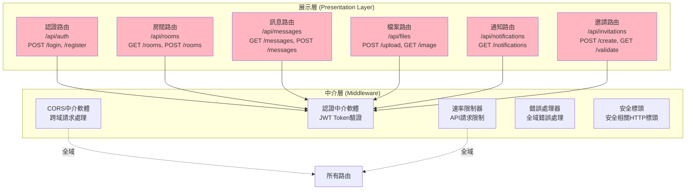

#### 業務層組件

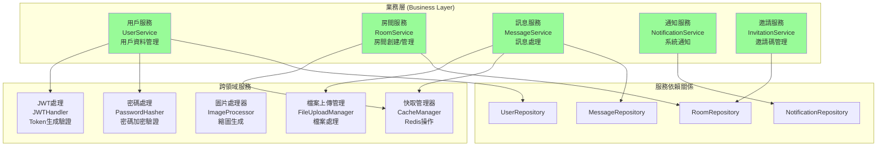

#### 資料層組件

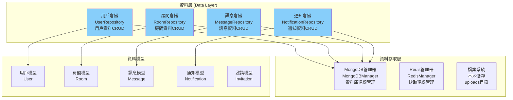

### 3.2 WebSocket 伺服器組件架構

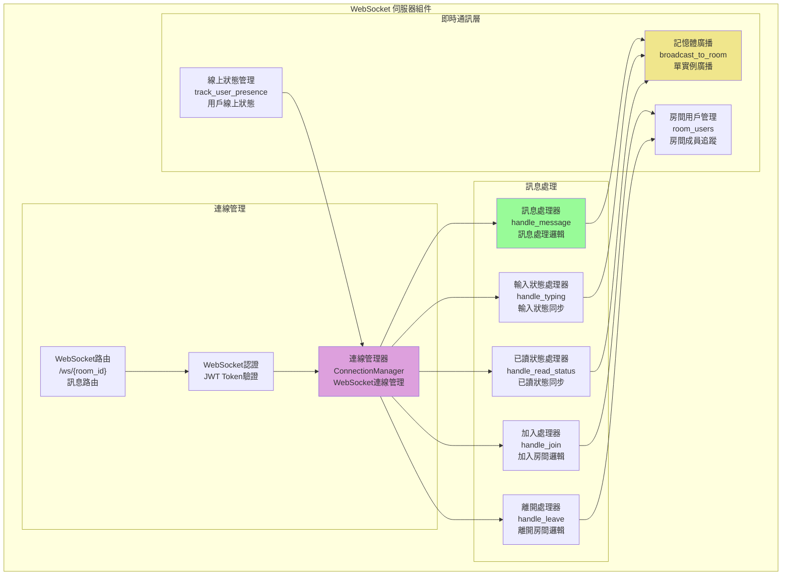

### 3.3 前端組件架構

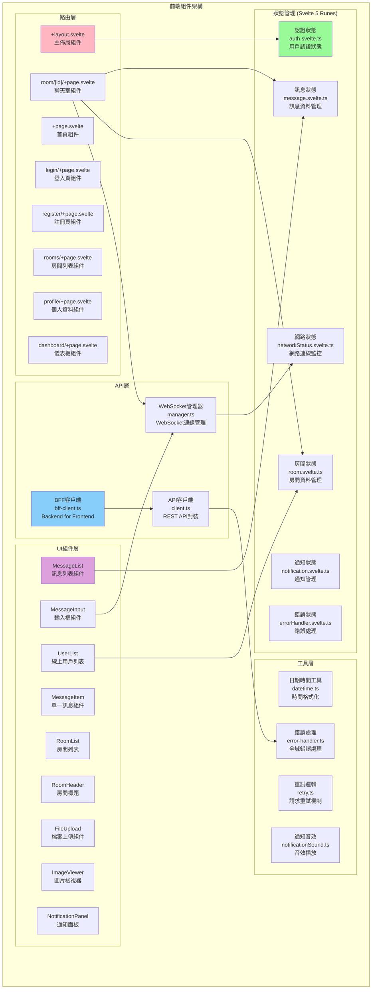

---

## C4 - 程式碼架構

### 4.1 依賴注入容器實現

#### 容器類別結構

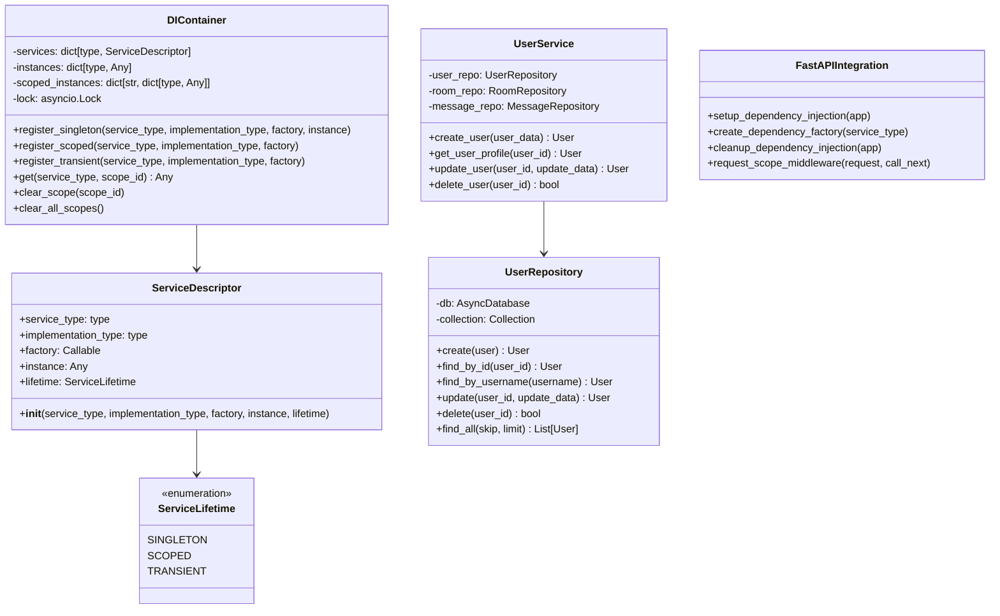

### 4.2 WebSocket 訊息處理流程（記憶體廣播）

#### 序列圖 - 訊息發送流程

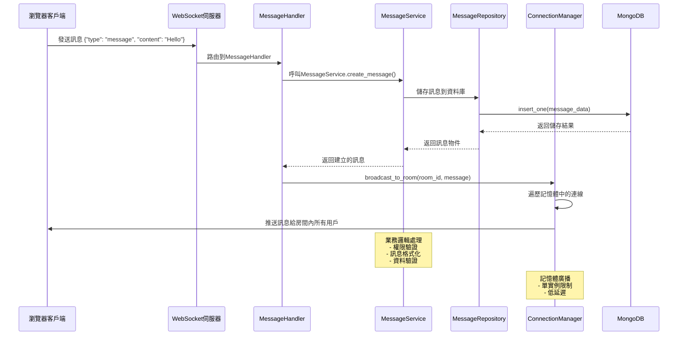

### 4.3 認證流程程式碼層級

#### 認證序列圖

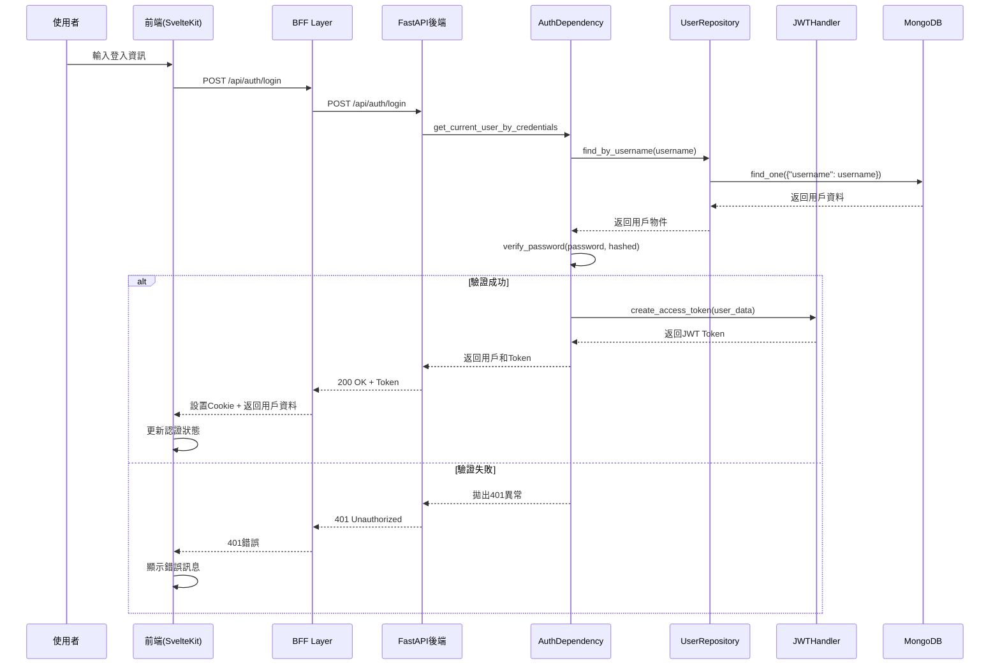

---

## 資料流架構

### 資料流圖

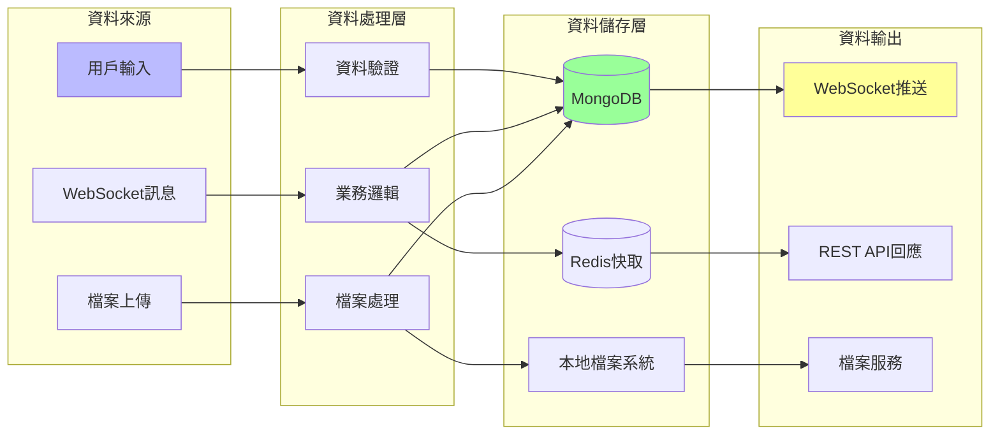

---

## 架構決策記錄 (ADR)

### ADR-001: 技術堆疊選擇

**狀態**: 已實作
**決策**: 使用 FastAPI + MongoDB + SvelteKit 技術堆疊
**原因**:

- FastAPI: 高效能、自動API文檔、類型安全、內建WebSocket支援
- MongoDB: 文件資料庫、靈活Schema、易於開發
- SvelteKit: 編譯時優化、響應式、輕量級、內建路由

### ADR-002: 架構模式

**狀態**: 已實作
**決策**: 採用三層架構 + 依賴注入模式
**原因**:

- 分離關注點，提高可維護性
- 支援單元測試和整合測試
- 降低耦合度，提高可擴展性
- 依賴注入容器實現服務生命週期管理

### ADR-003: 即時通訊方案

**狀態**: 已實作
**決策**: WebSocket + 記憶體廣播架構
**原因**:

- WebSocket: 雙向即時通訊，低延遲
- 記憶體廣播: 實作簡單、效能優異
- 單實例限制: 適合中小型應用，避免複雜性
- 未來擴展: 可改為Redis Pub/Sub實現水平擴展

### ADR-004: 檔案儲存策略

**狀態**: 已實作
**決策**: 本地檔案系統儲存
**原因**:

- 實作簡單，無需外部服務
- 適合開發和小型部署
- 檔案通過FastAPI端點服務
- 未來可遷移至S3或其他雲端儲存

### ADR-005: 前端狀態管理

**狀態**: 已實作
**決策**: Svelte 5 Runes + BFF模式
**原因**:

- Svelte 5 Runes: 新的響應式系統，更好的TypeScript支援
- BFF (Backend for Frontend): 簡化前端邏輯，統一API介面
- 減少前端複雜度，提升開發效率

---

## 系統限制與未來改進

### 目前限制

1. **單實例限制**: WebSocket使用記憶體廣播，無法水平擴展
2. **檔案儲存**: 本地儲存限制了多實例部署
3. **缺少外部服務**: 無郵件服務、推播通知等功能

### 未來改進方向

1. **水平擴展**: 實作Redis Pub/Sub替代記憶體廣播
2. **雲端儲存**: 整合S3或其他物件儲存服務
3. **外部服務整合**: 加入郵件、推播等通知服務
4. **API版本控制**: 加入/api/v1前綴支援版本管理
5. **完整容器化**: 將前後端應用加入docker-compose

---
