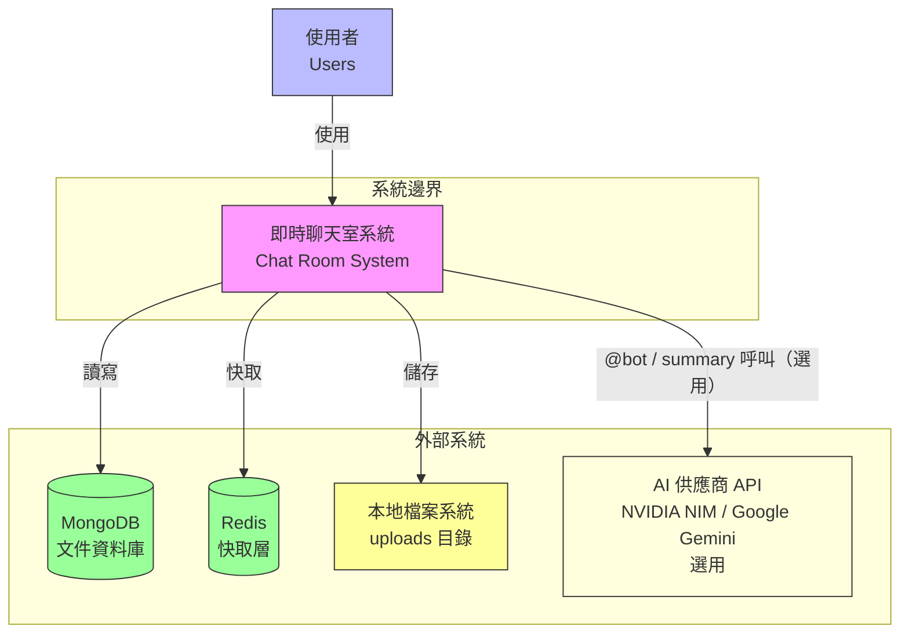
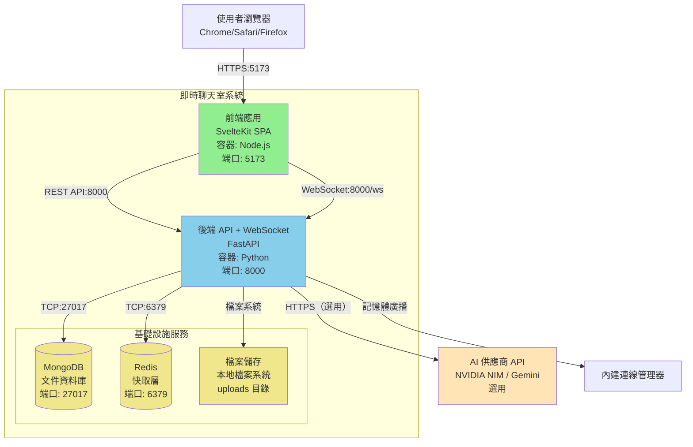
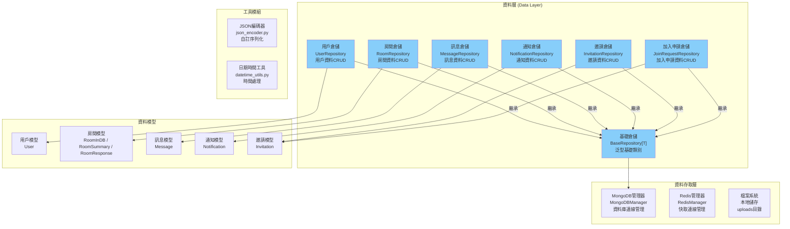
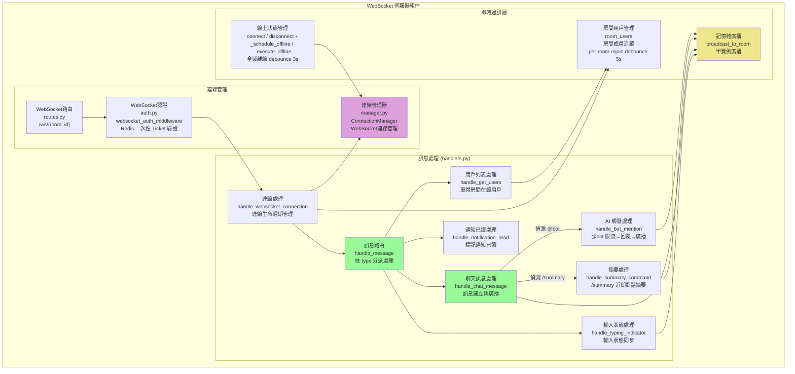
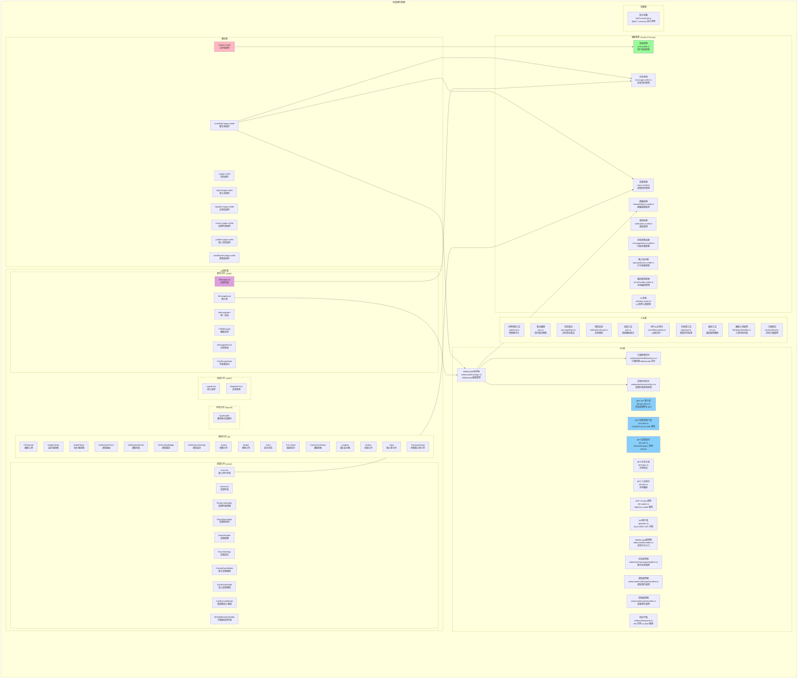
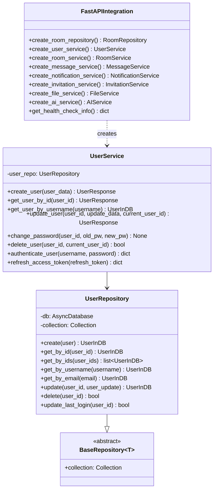
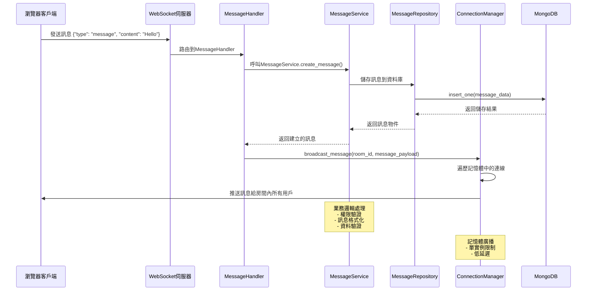
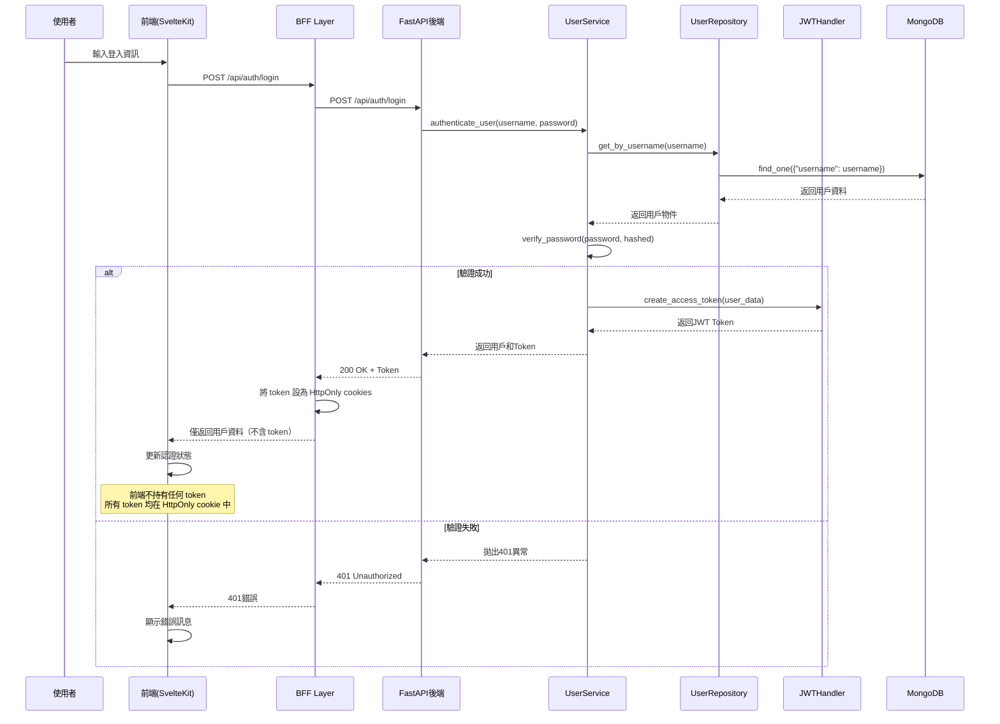
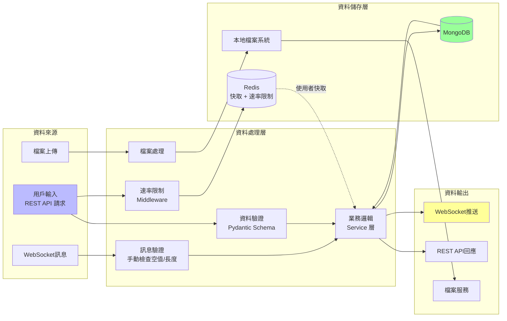

# 即時聊天室系統 - C4 架構文檔

## 目錄

1. [系統概述](#系統概述)
2. [C1 - 系統上下文](#c1---系統上下文)
3. [C2 - 容器架構](#c2---容器架構)
4. [C3 - 組件架構](#c3---組件架構)
5. [C4 - 程式碼架構](#c4---程式碼架構)
6. [資料流架構](#資料流架構)

---

## 系統概述

**系統名稱**: 即時多人聊天室系統

**系統描述**: 基於 FastAPI + MongoDB + SvelteKit 的即時通訊平台，支援多房間、檔案分享、即時通知、AI 助理（@bot / summary，選用）等功能。

**技術架構**: 三層架構 + 依賴注入 + 記憶體WebSocket廣播架構

**部署方式**: Docker容器化部署，單實例限制

---

## C1 - 系統上下文

### 系統邊界圖


```mermaid
graph TB
    subgraph "系統邊界"
        ChatSystem[即時聊天室系統<br/>Chat Room System]
    end

    User[使用者<br/>Users]

    subgraph "外部系統"
        MongoDB[(MongoDB<br/>文件資料庫)]
        Redis[(Redis<br/>快取層)]
        FileStorage[本地檔案系統<br/>uploads 目錄]
        LLMProvider[AI 供應商 API<br/>NVIDIA NIM / Google Gemini<br/>選用]
    end

    User -->|使用| ChatSystem

    ChatSystem -->|讀寫| MongoDB
    ChatSystem -->|快取| Redis
    ChatSystem -->|儲存| FileStorage
    ChatSystem -->|"@bot / summary 呼叫（選用"）| LLMProvider

    style ChatSystem fill:#f9f,stroke:#333
    style User fill:#bbf,stroke:#333
    style MongoDB fill:#9f9,stroke:#333
    style Redis fill:#9f9,stroke:#333
    style FileStorage fill:#ff9,stroke:#333
    style LLMProvider fill:#ffd,stroke:#333
```

### 關係說明

| 參與者 | 與系統關係 | 通訊協議 | 資料類型 |
|--------|------------|----------|----------|
| **使用者** | 使用聊天功能 | HTTPS, WebSocket | 聊天訊息、檔案 |
| **MongoDB** | 持久化儲存 | TCP/IP | 用戶資料、訊息記錄、房間資料 |
| **Redis** | 快取層 | TCP/IP | 快取資料、速率限制 |
| **檔案儲存** | 本地檔案儲存 | 檔案系統 | 圖片、文件、媒體檔案 |
| **AI 供應商**（選用） | @bot 問答 / 對話摘要 | HTTPS | 送出近期對話內容，回傳生成文字 |

---

## C2 - 容器架構

### 容器部署圖


```mermaid
graph TB
    subgraph "即時聊天室系統"
        Frontend[前端應用<br/>SvelteKit SPA<br/>容器: Node.js<br/>端口: 5173]
        Backend[後端 API + WebSocket<br/>FastAPI<br/>容器: Python<br/>端口: 8000]

        subgraph "基礎設施服務"
            MongoDB[(MongoDB<br/>文件資料庫<br/>端口: 27017)]
            Redis[(Redis<br/>快取層<br/>端口: 6379)]
            FileStorage[檔案儲存<br/>本地檔案系統<br/>uploads 目錄]
        end
    end

    User[使用者瀏覽器<br/>Chrome/Safari/Firefox]
    LLMProvider[AI 供應商 API<br/>NVIDIA NIM / Gemini<br/>選用]

    User -->|HTTPS:5173| Frontend
    Frontend -->|REST API:8000| Backend
    Frontend -->|WebSocket:8000/ws| Backend

    Backend -->|TCP:27017| MongoDB
    Backend -->|TCP:6379| Redis
    Backend -->|檔案系統| FileStorage
    Backend -->|HTTPS（選用）| LLMProvider

    Backend -->|記憶體廣播| ConnectionManager[內建連線管理器]

    style Frontend fill:#90EE90
    style Backend fill:#87CEEB
    style MongoDB fill:#F0E68C
    style Redis fill:#F0E68C
    style FileStorage fill:#F0E68C
    style LLMProvider fill:#FFE4B5
```

### 容器技術規格

| 容器 | 技術堆疊 | 主要功能 | 擴展性 |
|------|----------|----------|--------|
| **前端** | SvelteKit + TypeScript + DaisyUI | 用戶界面、路由、狀態管理 | 水平擴展 |
| **後端 API + WebSocket** | FastAPI + Python + uvicorn | REST API、WebSocket、業務邏輯 | 單實例（記憶體廣播限制） |
| **MongoDB** | MongoDB | 資料持久化  | 垂直擴展 |
| **Redis** | Redis | 快取層、速率限制  | 垂直擴展 |

---

## C3 - 組件架構

### 3.1 後端 API 組件架構

#### 展示層組件


```mermaid
graph TB
    subgraph "展示層 (Presentation Layer)"
        AuthRouter[認證路由<br/>/api/auth<br/>POST /login, /register]
        RoomRouter[房間路由<br/>/api/rooms<br/>GET /rooms, POST /rooms]
        MessageRouter[訊息路由<br/>/api/messages<br/>GET /messages, POST /messages]
        FileRouter["檔案路由<br/>/api/files<br/>POST /upload, GET /{file_type}/{filename}"]
        NotificationRouter[通知路由<br/>/api/notifications<br/>GET /notifications, DELETE /notifications]
        InvitationRouter["邀請路由<br/>/api/invitations<br/>POST /rooms/{room_id}/invitations, POST /validate"]
        WsTicketRouter[WS Ticket 路由<br/>/api/ws<br/>POST /ticket]
        AIRouter[AI 狀態路由<br/>/api/ai<br/>GET /status]
    end

    subgraph "中介層 (Middleware & Auth)"
        CORSMiddleware[CORS中介軟體<br/>跨域請求處理]
        AuthDependency[認證依賴注入<br/>Depends&#40;get_current_user&#41;<br/>JWT Token驗證]
        RoomAuthDependency[房間授權依賴注入<br/>Depends&#40;require_room_membership&#41;<br/>成員資格檢查]
        RateLimiter[速率限制中介軟體<br/>RateLimitingMiddleware<br/>API請求限制]
        AppErrorHandler[業務異常處理器<br/>app_error_handler<br/>AppError→JSON回應]
        ErrorHandler[全域錯誤處理器<br/>GlobalErrorHandler<br/>基礎設施異常]
        SecurityHeaders[安全標頭中介軟體<br/>SecurityHeadersMiddleware]
    end

    AuthRouter --> AuthDependency
    RoomRouter --> AuthDependency
    RoomRouter --> RoomAuthDependency
    MessageRouter --> AuthDependency
    MessageRouter --> RoomAuthDependency
    FileRouter --> AuthDependency
    NotificationRouter --> AuthDependency
    InvitationRouter --> AuthDependency
    WsTicketRouter --> AuthDependency
    AIRouter --> AuthDependency

    CORSMiddleware -.->|全域| AllRoutes[所有路由]
    RateLimiter -.->|全域| AllRoutes

    style AuthRouter fill:#FFB6C1
    style RoomRouter fill:#FFB6C1
    style MessageRouter fill:#FFB6C1
    style FileRouter fill:#FFB6C1
    style NotificationRouter fill:#FFB6C1
    style InvitationRouter fill:#FFB6C1
    style WsTicketRouter fill:#FFB6C1
    style AIRouter fill:#FFB6C1
```

#### 業務層組件


```mermaid
graph TB
    subgraph "業務層 (Business Layer)"
        UserService[用戶服務<br/>UserService<br/>用戶資料管理]
        RoomService[房間服務<br/>RoomService<br/>房間創建/管理]
        MessageService[訊息服務<br/>MessageService<br/>訊息處理]
        NotificationService[通知服務<br/>NotificationService<br/>系統通知]
        InvitationService[邀請服務<br/>InvitationService<br/>邀請碼與加入申請管理]
        FileService[檔案服務<br/>FileService<br/>檔案上傳與存取管理]
        AIService[AI 助理服務<br/>AIService<br/>LLM 呼叫封裝（無狀態）]
    end

    subgraph "服務依賴關係"
        UserService --> UserRepo[UserRepository]
        RoomService --> RoomRepo[RoomRepository]
        RoomService --> UserRepo
        RoomService --> MessageRepo[MessageRepository]
        MessageService --> MessageRepo
        MessageService --> RoomRepo
        MessageService --> UserRepo
        NotificationService --> NotificationRepo[NotificationRepository]
        InvitationService --> InvitationRepo[InvitationRepository]
        InvitationService --> JoinRequestRepo[JoinRequestRepository]
        InvitationService --> RoomRepo
        InvitationService --> UserRepo
        FileService --> FileUploadUtils2[FileUploadManager]
        FileService --> ImageProcessor2[ImageProcessor]
    end

    subgraph "跨領域服務"
        FileUploadUtils[檔案上傳工具<br/>file_upload.py<br/>檔案處理工具函式]
        ImageProcessor[圖片處理器<br/>ImageProcessor<br/>縮圖生成]
        PasswordUtils[密碼處理<br/>password.py<br/>密碼加密驗證]
        JWTHandler[JWT處理<br/>JWTHandler<br/>Token生成驗證]
        UserCache[使用者快取<br/>user_cache.py<br/>Redis fail-open 快取 TTL 5min]
        WsTicket[WS Ticket<br/>ws_ticket.py<br/>Redis 一次性 ticket TTL 30s]
        BotIdentity[Bot 身分<br/>core/bot.py<br/>種子化 + 觸發判斷]
    end

    UserService --> PasswordUtils
    UserService --> JWTHandler
    UserService --> UserCache

    style UserService fill:#98FB98
    style RoomService fill:#98FB98
    style MessageService fill:#98FB98
    style NotificationService fill:#98FB98
    style InvitationService fill:#98FB98
    style FileService fill:#98FB98
    style AIService fill:#98FB98
```

#### 資料層組件


```mermaid
graph TB
    subgraph "資料層 (Data Layer)"
        BaseRepository["基礎倉儲<br/>BaseRepository[T]<br/>泛型基礎類別"]
        UserRepository[用戶倉儲<br/>UserRepository<br/>用戶資料CRUD]
        RoomRepository[房間倉儲<br/>RoomRepository<br/>房間資料CRUD]
        MessageRepository[訊息倉儲<br/>MessageRepository<br/>訊息資料CRUD]
        NotificationRepository[通知倉儲<br/>NotificationRepository<br/>通知資料CRUD]
        InvitationRepository[邀請倉儲<br/>InvitationRepository<br/>邀請資料CRUD]
        JoinRequestRepository[加入申請倉儲<br/>JoinRequestRepository<br/>加入申請資料CRUD]
    end

    UserRepository -->|繼承| BaseRepository
    RoomRepository -->|繼承| BaseRepository
    MessageRepository -->|繼承| BaseRepository
    NotificationRepository -->|繼承| BaseRepository
    InvitationRepository -->|繼承| BaseRepository
    JoinRequestRepository -->|繼承| BaseRepository

    subgraph "資料存取層"
        MongoDBManager[MongoDB管理器<br/>MongoDBManager<br/>資料庫連線管理]
        RedisManager[Redis管理器<br/>RedisManager<br/>快取連線管理]
        FileSystem[檔案系統<br/>本地儲存<br/>uploads目錄]
    end

    subgraph "資料模型"
        UserModel[用戶模型<br/>User]
        RoomModel[房間模型<br/>RoomInDB / RoomSummary / RoomResponse]
        MessageModel[訊息模型<br/>Message]
        NotificationModel[通知模型<br/>Notification]
        InvitationModel[邀請模型<br/>Invitation]
    end

    subgraph "工具模組"
        JsonEncoder[JSON編碼器<br/>json_encoder.py<br/>自訂序列化]
        DatetimeUtils[日期時間工具<br/>datetime_utils.py<br/>時間處理]
    end

    BaseRepository --> MongoDBManager
    %% 錯誤處理：Repository 不攔截 DB 異常，由 GlobalErrorHandler 中間件統一處理

    UserRepository --> UserModel
    RoomRepository --> RoomModel
    MessageRepository --> MessageModel
    NotificationRepository --> NotificationModel
    InvitationRepository --> InvitationModel
    JoinRequestRepository --> InvitationModel

    style BaseRepository fill:#87CEFA
    style UserRepository fill:#87CEFA
    style RoomRepository fill:#87CEFA
    style MessageRepository fill:#87CEFA
    style NotificationRepository fill:#87CEFA
    style InvitationRepository fill:#87CEFA
    style JoinRequestRepository fill:#87CEFA
```

### 3.2 WebSocket 伺服器組件架構


```mermaid
graph TB
    subgraph "WebSocket 伺服器組件"
        subgraph "連線管理"
            WebSocketRouter["WebSocket路由<br/>routes.py<br/>/ws/{room_id}"]
            WebSocketAuth[WebSocket認證<br/>auth.py<br/>websocket_auth_middleware<br/>Redis 一次性 Ticket 驗證]
            ConnectionManager[連線管理器<br/>manager.py<br/>ConnectionManager<br/>WebSocket連線管理]
        end

        subgraph "訊息處理 (handlers.py)"
            WSConnection[連線處理<br/>handle_websocket_connection<br/>連線生命週期管理]
            MessageHandler[訊息路由<br/>handle_message<br/>依 type 分派處理]
            ChatHandler[聊天訊息處理<br/>handle_chat_message<br/>訊息建立與廣播]
            TypingHandler[輸入狀態處理<br/>handle_typing_indicator<br/>輸入狀態同步]
            GetUsersHandler[用戶列表處理<br/>handle_get_users<br/>取得房間在線用戶]
            NotifReadHandler[通知已讀處理<br/>handle_notification_read<br/>標記通知已讀]
            BotHandler[AI 觸發處理<br/>handle_bot_mention<br/>@bot 限流→回覆→廣播]
            SummaryHandler[摘要處理<br/>handle_summary_command<br/>/summary 近期對話摘要]
        end

        subgraph "即時通訊層"
            MemoryBroadcast[記憶體廣播<br/>broadcast_to_room<br/>單實例廣播]
            UserPresence[線上狀態管理<br/>connect / disconnect +<br/>_schedule_offline / _execute_offline<br/>全域離線 debounce 3s]
            RoomUsers[房間用戶管理<br/>room_users<br/>房間成員追蹤<br/>per-room rejoin debounce 5s]
        end
    end

    WebSocketRouter --> WebSocketAuth
    WebSocketAuth --> WSConnection
    WSConnection --> ConnectionManager
    WSConnection --> MessageHandler

    MessageHandler --> ChatHandler
    MessageHandler --> TypingHandler
    MessageHandler --> GetUsersHandler
    MessageHandler --> NotifReadHandler

    ChatHandler -->|偵測 @bot| BotHandler
    ChatHandler -->|偵測 /summary| SummaryHandler
    BotHandler --> MemoryBroadcast
    SummaryHandler --> MemoryBroadcast
    ChatHandler --> MemoryBroadcast
    TypingHandler --> MemoryBroadcast
    GetUsersHandler --> RoomUsers
    WSConnection --> RoomUsers

    UserPresence --> ConnectionManager

    style ConnectionManager fill:#DDA0DD
    style MessageHandler fill:#98FB98
    style ChatHandler fill:#98FB98
    style MemoryBroadcast fill:#F0E68C
```

### 3.3 前端組件架構


```mermaid
graph TB
    subgraph "前端組件架構"
        subgraph "路由層"
            Layout[+layout.svelte<br/>主佈局組件]
            Home[+page.svelte<br/>首頁組件]
            Login[login/+page.svelte<br/>登入頁組件]
            Register[register/+page.svelte<br/>註冊頁組件]
            Room["room/[id]/+page.svelte"<br/>聊天室組件]
            Rooms[rooms/+page.svelte<br/>房間列表組件]
            Profile[profile/+page.svelte<br/>個人資料組件]
            Dashboard[dashboard/+page.svelte<br/>儀表板組件]
        end

        subgraph "狀態管理 (Svelte 5 Runes)"
            AuthStore[認證狀態<br/>auth.svelte.ts<br/>用戶認證狀態]
            RoomStore[房間狀態<br/>room.svelte.ts<br/>房間資料管理]
            MessageStore[訊息狀態<br/>message.svelte.ts<br/>訊息資料管理]
            NotificationStore[通知狀態<br/>notification.svelte.ts<br/>通知管理]
            NetworkStore[網路狀態<br/>networkStatus.svelte.ts<br/>網路連線監控]
            MessageStatusStore[訊息狀態追蹤<br/>messageStatus.svelte.ts<br/>已讀/未讀狀態]
            TypingStore[輸入指示器<br/>typingIndicator.svelte.ts<br/>打字狀態管理]
            ErrorHandlerStore[錯誤處理狀態<br/>errorHandler.svelte.ts<br/>全域錯誤管理]
            AIStatusStore[AI 狀態<br/>aiStatus.svelte.ts<br/>AI 助理上線狀態]
        end

        subgraph "API層"
            BFFApiClient[BFF API 客戶端<br/>bff-api-client.ts<br/>前端直接呼叫 BFF]
            BFFBackendClient[BFF 伺服端客戶端<br/>bff-client.ts<br/>SvelteKit server-side 轉發]
            BFFAuth[BFF 認證請求<br/>bff-auth.ts<br/>bffAuthRequest 透明 refresh]
            BFFTypes[BFF 型別定義<br/>bff-types.ts<br/>共用型別]
            BFFUtils[BFF 工具函式<br/>bff-utils.ts<br/>共用輔助]
            BFFCookie[BFF Cookie 處理<br/>bff-cookie.ts<br/>httpOnly cookie 讀寫]
            APIClient[API客戶端<br/>api/client.ts<br/>Axios REST API 封裝]
            WebSocketManager[WebSocket管理器<br/>websocket/manager.ts<br/>WebSocket連線管理]
            WSHandlers[WebSocket處理器<br/>websocket/handlers.ts<br/>訊息分派入口]
            WSMessageHandlers[訊息處理器<br/>websocket/messageHandlers.ts<br/>聊天訊息處理]
            WSNotificationHandlers[通知處理器<br/>websocket/notificationHandlers.ts<br/>通知事件處理]
            WSRoomHandlers[房間處理器<br/>websocket/roomHandlers.ts<br/>房間事件處理]
            ReadStatusSync[已讀狀態同步<br/>websocket/readStatusSync.ts<br/>已讀狀態 WebSocket 同步]
            RoomListSync[房間列表同步<br/>websocket/roomListSync.ts<br/>房間列表即時更新]
            WSGuards[型別守衛<br/>websocket/guards.ts<br/>WS 訊息 runtime 驗證]
        end

        subgraph "UI組件層"
            subgraph "聊天元件 (chat/)"
                MessageList[MessageList<br/>訊息列表]
                MessageInput[MessageInput<br/>輸入框]
                MessageItem[MessageItem<br/>單一訊息]
                FileMessage[FileMessage<br/>檔案訊息]
                MessageSearch[MessageSearch<br/>訊息搜尋]
                ChatEmptyState[ChatEmptyState<br/>空狀態提示]
            end

            subgraph "房間元件 (room/)"
                UserList[UserList<br/>線上用戶列表]
                RoomList[RoomList<br/>房間列表]
                RoomListHeader[RoomListHeader<br/>房間列表標題]
                RoomSearchBar[RoomSearchBar<br/>房間搜尋列]
                RoomHeader[RoomHeader<br/>房間標題]
                RoomSettings[RoomSettings<br/>房間設定]
                CreateRoomModal[CreateRoomModal<br/>建立房間彈窗]
                JoinRoomModal[JoinRoomModal<br/>加入房間彈窗]
                JoinByInviteModal[JoinByInviteModal<br/>邀請碼加入彈窗]
                MobileMembersModal[MobileMembersModal<br/>手機版成員列表]
            end

            subgraph "通用元件 (ui/)"
                FileUpload[FileUpload<br/>檔案上傳]
                ImageViewer[ImageViewer<br/>圖片檢視器]
                VideoPlayer[VideoPlayer<br/>影片播放器]
                NotificationPanel[NotificationPanel<br/>通知面板]
                NotificationButton[NotificationButton<br/>通知按鈕]
                NotificationBadge[NotificationBadge<br/>通知徽章]
                NotificationSettings[NotificationSettings<br/>通知設定]
                Avatar[Avatar<br/>頭像元件]
                Modal[Modal<br/>彈窗元件]
                Toast[Toast<br/>提示訊息]
                ErrorToast[ErrorToast<br/>錯誤提示]
                ConnectionStatus[ConnectionStatus<br/>連線狀態]
                Loading[Loading<br/>載入指示器]
                Button[Button<br/>按鈕元件]
                Input[Input<br/>輸入框元件]
                PasswordInput[PasswordInput<br/>密碼輸入框元件]
            end

            subgraph "佈局元件 (layout/)"
                AppHeader[AppHeader<br/>應用程式標題列]
            end

            subgraph "認證元件 (auth/)"
                LoginForm[LoginForm<br/>登入表單]
                RegisterForm[RegisterForm<br/>註冊表單]
            end
        end

        subgraph "工具層"
            DateTimeUtils[日期時間工具<br/>datetime.ts<br/>時間格式化]
            RetryLogic[重試邏輯<br/>retry.ts<br/>請求重試機制]
            MessageRetry[訊息重試<br/>messageRetry.ts<br/>訊息發送重試]
            NotificationSound[通知音效<br/>notificationSound.ts<br/>音效播放]
            AuthUtils[認證工具<br/>auth.ts<br/>認證輔助函式]
            UserIdNormalizer[用戶ID正規化<br/>userIdNormalizer.ts<br/>ID格式統一]
            ClipboardUtils[剪貼簿工具<br/>clipboard.ts<br/>複製到剪貼簿]
            ErrorUtils[錯誤工具<br/>error.ts<br/>錯誤處理輔助]
            FileUploadHandler[檔案上傳處理<br/>fileUploadHandler.ts<br/>上傳流程封裝]
            MarkAsRead[已讀標記<br/>markAsRead.ts<br/>訊息已讀處理]
        end

        subgraph "常數層"
            BotCommands["指令常數<br/>botCommands.ts<br/>@bot / summary 指令清單"]
        end
    end

    Layout --> AuthStore
    Room --> MessageStore
    Room --> RoomStore
    Room --> WebSocketManager

    MessageList --> MessageStore
    MessageInput --> WebSocketManager
    UserList --> RoomStore

    WebSocketManager --> NetworkStore
    WebSocketManager --> ReadStatusSync
    WebSocketManager --> RoomListSync

    style Layout fill:#FFB6C1
    style AuthStore fill:#98FB98
    style BFFApiClient fill:#87CEFA
    style BFFAuth fill:#87CEFA
    style BFFBackendClient fill:#87CEFA
    style MessageList fill:#DDA0DD
```

---

## C4 - 程式碼架構

### 4.1 依賴注入設計

#### FastAPI Depends 工廠函數模式

使用 FastAPI 原生 `Depends` 機制，透過工廠函數建立 Service 實例。HTTP Router 使用 `Depends` 自動注入，WebSocket 直接 `await` 呼叫工廠函數。Service 層不直接 import `connection_manager`，而是由 DI 工廠透過建構子注入，實現 Service 與 WebSocket 的解耦。除 Service 外，亦提供 `create_room_repository()` 工廠供 `require_room_membership` 等 auth dependency 直接注入 Repository（非 Service 場景）。


```mermaid
classDiagram
    class FastAPIIntegration {
        +create_room_repository() RoomRepository
        +create_user_service() UserService
        +create_room_service() RoomService
        +create_message_service() MessageService
        +create_notification_service() NotificationService
        +create_invitation_service() InvitationService
        +create_file_service() FileService
        +create_ai_service() AIService
        +get_health_check_info() dict
    }

    class UserService {
        -user_repo: UserRepository
        +create_user(user_data) UserResponse
        +get_user_by_id(user_id) UserResponse
        +get_user_by_username(username) UserInDB
        +update_user(user_id, update_data, current_user_id) UserResponse
        +change_password(user_id, old_pw, new_pw) None
        +delete_user(user_id, current_user_id) bool
        +authenticate_user(username, password) dict
        +refresh_access_token(refresh_token) dict
    }

    class UserRepository {
        -db: AsyncDatabase
        -collection: Collection
        +create(user) UserInDB
        +get_by_id(user_id) UserInDB
        +get_by_ids(user_ids) list~UserInDB~
        +get_by_username(username) UserInDB
        +get_by_email(email) UserInDB
        +update(user_id, user_update) UserInDB
        +delete(user_id) bool
        +update_last_login(user_id) bool
    }

    class BaseRepository~T~ {
        <<abstract>>
        +collection: Collection
    }

    FastAPIIntegration ..> UserService : creates
    UserService --> UserRepository
    UserRepository --|> BaseRepository
```

### 4.2 WebSocket 訊息處理流程（記憶體廣播）

#### 序列圖 - 訊息發送流程


```mermaid
sequenceDiagram
    participant Client as 瀏覽器客戶端
    participant WS as WebSocket伺服器
    participant Handler as MessageHandler
    participant Service as MessageService
    participant Repo as MessageRepository
    participant Manager as ConnectionManager
    participant Mongo as MongoDB

    Client->>WS: 發送訊息 {"type": "message", "content": "Hello"}
    WS->>Handler: 路由到MessageHandler
    Handler->>Service: 呼叫MessageService.create_message()
    Service->>Repo: 儲存訊息到資料庫
    Repo->>Mongo: insert_one(message_data)
    Mongo-->>Repo: 返回儲存結果
    Repo-->>Service: 返回訊息物件
    Service-->>Handler: 返回建立的訊息
    Handler->>Manager: broadcast_message(room_id, message_payload)
    Manager->>Manager: 遍歷記憶體中的連線
    Manager->>Client: 推送訊息給房間內所有用戶

    Note over Service: 業務邏輯處理<br/>- 權限驗證<br/>- 訊息格式化<br/>- 資料驗證
    Note over Manager: 記憶體廣播<br/>- 單實例限制<br/>- 低延遲
```

### 4.3 認證流程程式碼層級

#### 認證序列圖


```mermaid
sequenceDiagram
    participant User as 使用者
    participant Frontend as 前端(SvelteKit)
    participant BFF as BFF Layer
    participant API as FastAPI後端
    participant Service as UserService
    participant UserRepo as UserRepository
    participant JWT as JWTHandler
    participant Mongo as MongoDB

    User->>Frontend: 輸入登入資訊
    Frontend->>BFF: POST /api/auth/login
    BFF->>API: POST /api/auth/login
    API->>Service: authenticate_user(username, password)
    Service->>UserRepo: get_by_username(username)
    UserRepo->>Mongo: find_one({"username": username})
    Mongo-->>UserRepo: 返回用戶資料
    UserRepo-->>Service: 返回用戶物件
    Service->>Service: verify_password(password, hashed)

    alt 驗證成功
        Service->>JWT: create_access_token(user_data)
        JWT-->>Service: 返回JWT Token
        Service-->>API: 返回用戶和Token
        API-->>BFF: 200 OK + Token
        BFF->>BFF: 將 token 設為 HttpOnly cookies
        BFF-->>Frontend: 僅返回用戶資料（不含 token）
        Frontend->>Frontend: 更新認證狀態
        Note over Frontend: 前端不持有任何 token<br/>所有 token 均在 HttpOnly cookie 中
    else 驗證失敗
        Service-->>API: 拋出401異常
        API-->>BFF: 401 Unauthorized
        BFF-->>Frontend: 401錯誤
        Frontend->>Frontend: 顯示錯誤訊息
    end
```

---

## 資料流架構

### 資料流圖


```mermaid
graph LR
    subgraph "資料來源"
        UserInput[用戶輸入<br/>REST API 請求]
        WebSocketMsg[WebSocket訊息]
        FileUpload[檔案上傳]
    end

    subgraph "資料處理層"
        Validation[資料驗證<br/>Pydantic Schema]
        WSValidation[訊息驗證<br/>手動檢查空值/長度]
        BusinessLogic[業務邏輯<br/>Service 層]
        FileProcessor[檔案處理]
        RateLimiter[速率限制<br/>Middleware]
    end

    subgraph "資料儲存層"
        MongoDB[(MongoDB)]
        Redis[(Redis<br/>快取 + 速率限制)]
        LocalFS[本地檔案系統]
    end

    subgraph "資料輸出"
        WebSocketPush[WebSocket推送]
        RESTAPI[REST API回應]
        FileServe[檔案服務]
    end

    UserInput --> Validation
    UserInput --> RateLimiter
    WebSocketMsg --> WSValidation
    WSValidation --> BusinessLogic
    FileUpload --> FileProcessor

    Validation --> BusinessLogic
    BusinessLogic --> MongoDB
    FileProcessor --> LocalFS
    RateLimiter --> Redis

    MongoDB --> BusinessLogic
    BusinessLogic --> WebSocketPush
    BusinessLogic --> RESTAPI
    Redis -.->|使用者快取| BusinessLogic
    LocalFS --> FileServe

    style UserInput fill:#bbf
    style MongoDB fill:#9f9
    style WebSocketPush fill:#ff9
```

---

## 架構決策記錄 (ADR)

### ADR-001: 架構模式

**狀態**: 已實作
**決策**: 採用三層架構（Router → Service → Repository）+ 依賴注入 + BFF 模式

**適用場景**: 這套組合是為多人協作、長期維護、規模擴展設計的。好處在中大型專案與團隊協作時最為明顯；小專案或一人開發時，分層的維護成本會先於好處顯現。

**好處**:

- **分層（關注點分離）**: 不同開發者可以同時修改 Repository 和 Router 而不衝突，降低協作時的合併衝突風險
- **依賴注入（DI）**: 使用 FastAPI 原生 Depends 搭配工廠函數，方便抽換實作，同時大幅簡化單元測試的 mock 設置
- **BFF（Backend for Frontend）**: 前後端團隊可以獨立部署、各自演進 API；JWT token 由 BFF 層以 HttpOnly cookie 管理，避免前端直接持有敏感憑證；BFF 統一處理 token 過期重新導向，前端不需重複實作認證邏輯
- 支援單元測試和整合測試
- 降低耦合度，提高可擴展性

**代價**:

- **多層穿透成本**: 每個功能需要穿過 5 層實作（Repository → Service → Router → BFF 路由 → 前端型別），增加開發時間和程式碼量
- **連帶維護負擔**: 當某一層的方法需要修改或移除時，其餘各層都需要同步調整，變更的影響範圍較大

### ADR-002: 即時通訊方案

**狀態**: 已實作
**決策**: Per-Room WebSocket + 記憶體廣播架構
**原因**:

- WebSocket: 雙向即時通訊，低延遲
- 記憶體廣播: 實作簡單、效能優異
- 單實例限制: 適合中小型應用，避免複雜性
- 兩層 Debounce: 全域離線 debounce（3s）避免短暫斷線誤判離線；per-room rejoin debounce（5s）抑制快速切換房間時的重複 `user_joined` 廣播
- 未來擴展: 可改為Redis Pub/Sub實現水平擴展

#### 目前架構：Per-Room WebSocket

使用者進入聊天室時才建立 WebSocket 連線（`/ws/{room_id}`），離開即斷開，同時只維持一條連線：

```
進入房間 A → 建立 WS 連線
切換到房間 B → 斷開 A → 建立 B
離開聊天室（回到 Dashboard）→ 斷開 B → 無連線
```

這是最直覺的設計：一條連線對應一個房間，伺服器不需要管理訂閱狀態或訊息路由。

#### 主流架構（對比參考）：單一全域 WebSocket + 訊息多工

Slack、Discord、LINE 等主流聊天應用採用不同的做法：

```
登入後建立 1 條 WS 連線（與房間無關）
  → 所有房間的訊息都透過這條連線推送
  → 客戶端告訴伺服器「我正在看哪個房間」（focus/subscribe）
  → 伺服器根據 focus 狀態決定推送細節
    （正在看的房間推完整訊息，其他房間只推通知）
```

#### 兩者差異

| 面向 | 目前（Per-Room） | 主流（單一全域） |
|------|-----------------|----------------|
| 連線生命週期 | 綁定房間，進出房間時建立/斷開 | 綁定登入狀態，登入後持續存在 |
| 切換房間 | 斷舊連線 → HTTP 請求 → 建新連線（有短暫空窗） | 發送 focus 訊息，連線不斷 |
| 不在聊天室時（Dashboard） | 無連線，收不到即時事件 | 有連線，正常接收 |
| 跨房間即時事件 | 在聊天室時正常（`send_event()` 透過任意連線送達） | 隨時正常 |
| 通知 | DB 持久化不受影響；即時彈出僅在有連線時 | 隨時即時彈出 |
| 實作複雜度 | 低（連線與房間 1:1） | 較高（需管理訂閱狀態、訊息路由） |

#### 實際影響評估

Per-Room 架構的影響比預期小，因為：

1. **通知不會丟失** — `notification_service` 先寫入 MongoDB 再嘗試 WS 推播，使用者打開通知面板時透過 HTTP API 讀取，全部看得到
2. **在聊天室時跨房間事件正常** — `send_event()` 會透過使用者任意一條活躍連線送達，不限於事件來源的房間
3. **唯一盲區** — 使用者停在 Dashboard 不進任何房間時，看不到即時的房間列表更新和通知彈出（需手動重新整理）
4. **切換房間空窗** — 斷舊連線到建新連線之間約數百毫秒，期間即時推播送不到（影響極小）

**目前決策：維持 Per-Room 架構。** 核心功能沒有缺陷，改為單一全域 WS 等於重寫 WebSocket 層（後端 endpoint/handler/manager + 前端 manager 全部要改），改動量大且風險高，目前不值得。若未來跨房間即時功能需求增加，再評估重構。

### ADR-003: 訊息管線可靠投遞（seq / ack / 冪等）

**狀態**: Phase 0+1+2 已實作（2026-06）
**決策**: 為訊息引入 per-room 單調遞增序號（seq）作為核心 primitive，搭配真 ack 協議與冪等去重

#### 背景問題

原始訊息管線缺乏交付保證：

1. **偽 ack** — 前端 `ws.send()` 成功即標記「已送達」，實際只代表訊息離開了瀏覽器，伺服器是否持久化未知
2. **無去重** — 網路不穩重送時產生重複訊息（前端有 `temp_id` 但後端不檢查）
3. **排序依賴時鐘** — 只靠 `created_at` 排序，高頻訊息或時鐘偏差時順序不穩定
4. **斷線盲補** — 重連後盲目重發最近 50 條，會漏也會重
5. **編輯/刪除不同步** — REST 端點存在但無 WS 廣播，其他成員需刷新才看到

#### 核心洞察：一個 primitive 解四個問題

```
seq ──┬── 排序不再依賴時鐘
      ├── 斷線重連 = 「給我 seq > N 的訊息」（精確補發）
      ├── 分頁 = 游標式 seq < N（取代 skip/limit）
      └── 已讀 = 每人每房一個 last_read_seq 指標
```

#### 決策 1：seq 來源 — MongoDB counter（非 Redis INCR）

每次建立訊息時，對 `counters` collection 執行原子操作：

```python
db["counters"].find_one_and_update(
    {"_id": f"room_seq:{room_id}"}, {"$inc": {"seq": 1}},
    upsert=True, return_document=ReturnDocument.AFTER,
)
```

| 考量 | MongoDB counter（採用） | Redis INCR（未採用） |
|------|------------------------|---------------------|
| 正確性 | 原子、持久、崩潰不回退 | Redis 崩潰且持久化落後時計數器回退 → 重複 seq |
| 效能 | 每則訊息多一次 DB roundtrip（~1ms） | 純記憶體，更快 |
| 架構一致性 | MongoDB 維持單一事實來源 | Redis 從「fail-open 輔助」升級為寫入路徑關鍵依賴 |

本專案哲學是「Redis 掛掉不影響核心功能」（rate limiting 與快取皆 fail-open），seq 若依賴 Redis 會打破此原則。聊天訊息的寫入頻率下，1ms 的代價可接受。

**seq 允許空洞**：取號後建立失敗（驗證錯誤、撞唯一索引）該號作廢。下游一律使用「seq > N」範圍查詢而非連續性假設，空洞無影響。

#### 決策 2：冪等契約 — unique index 保底 + 雙路徑處理

- 客戶端為每則訊息產生 `client_id`，重送時帶相同值
- `(room_id, client_id)` partial unique index（僅對 string 生效）為 DB 層保底
- Service 層：快速路徑先查 `get_by_client_id`；併發競態撞 `DuplicateKeyError` 時 fallback 查詢並回傳既有訊息

**安全順序**：冪等查詢必須放在成員資格驗證**之後**，否則非成員可用 (room_id, client_id) 探測訊息內容。

**分層例外**：本專案規範禁止 Service 攔截 `PyMongoError`（基礎設施錯誤應由 GlobalErrorHandler 處理），但冪等 create 的 `DuplicateKeyError` 是**冪等契約的預期結果**而非基礎設施故障——「重送 = 成功，回傳第一次的結果」正是業務語意，故此處的窄域 catch 是規範的有意例外（reviewer checklist 已同步註記）。

#### 決策 3：真 ack 協議

```
客戶端                     伺服器
  │ ── message{client_id} ──▶ │ 持久化（取 seq）
  │ ◀── ack{client_id,        │
  │       message_id, seq} ── │ （先 ack 發送者）
  │ ◀── broadcast{...} ────── │ （再廣播全房間）
```

- 前端 `sending` 狀態持續到收到 ack；10 秒未收到 ack → `failed`（交給重試機制）
- 斷線時所有 pending ack 立即標記 failed，重連後自動重試——因為有冪等保底，「實際已存但 ack 丟失」的重送不會產生重複
- 樂觀 UI：發送當下以 `client_id` 為鍵插入 pending 訊息，ack/廣播到達時原地確認取代

#### 決策 4：Phase 2 — 兌現 seq 的價值（游標分頁 + 精確 gap 補發）

Phase 0+1 把 seq 建立起來後，Phase 2 用它取代兩個原本依賴 `skip/limit` 與「盲發最近 50 條」的脆弱機制：

- **游標分頁**：訊息列表查詢支援 `before_seq`，以 `seq < before_seq` 為游標取代 `skip/limit` 偏移。偏移分頁在訊息增刪後會錯位（同一筆被翻兩次或被跳過），游標分頁不受影響。舊資料無 seq 時 fallback 回 `skip`，向後相容。
- **斷線 gap 精確補發**：WS 重連時客戶端帶上本地最大 `last_seq`（並驗證該 seq 屬於同一房間才帶），伺服器只補發 `seq > last_seq` 的訊息，透過 `message_sync` 事件送回——精確、不重不漏，取代原本「重連盲發最近 50 條」的會漏也會重行為。
- **gap 上限保護**：`SYNC_MAX_GAP = 200`。gap 超過上限時改為 `full_reload`（回傳最新訊息並標記 `full_reload=true`），客戶端清空本地後以該批重載，避免一次推送過多訊息。gap 為 0 時不送任何訊息。
- **一次性遷移腳本**：`scripts/backfill_message_seq.py` 為既有無 seq 的訊息補號並校正 `counters`（冪等，可重複執行）。

```
重連 → 帶 last_seq=N
  ├─ gap = 0          → 無需補發
  ├─ 0 < gap ≤ 200    → message_sync 補發 seq > N 的訊息（精確）
  └─ gap > 200        → message_sync(full_reload=true)，客戶端清空重載
```

#### 後續階段

- Phase 3（待做）：訊息級已讀 — 每人每房 `last_read_seq` 指標（寫入量 O(成員數)，對比 per-message `read_by` 陣列的 O(成員數×訊息數)）

### ADR-004: AI 聊天助理（@bot）

**狀態**: 已實作（2026-06）
**決策**: 內建 AI 助理，使用 Pydantic AI 封裝 LLM；bot 為真實使用者身分，LLM 商業邏輯收斂於 Service 層

#### 決策 1：bot 是真實 MongoDB 使用者，而非合成 sender

Bot 擁有固定 `user_id`，啟動時冪等種子化（隨機密碼，永不可登入）。如此 bot 訊息可走**正規訊息流**（`create_message` → 取 seq → 持久化 → 廣播），前端無需特例即可正常渲染 bot 的頭像／暱稱，bot 回覆也能被 ADR-003 的 gap 補發機制涵蓋。代價是多一個種子使用者，但換得整條訊息管線對 bot 與真人一致。

#### 決策 2：LLM 呼叫收斂於 Service 層

`AIService` 封裝所有 LLM 互動，WebSocket handler 只負責「判斷觸發 → 呼叫 service → 廣播結果」，不寫商業邏輯。符合三層架構，也讓 AI 邏輯可獨立測試（Pydantic AI 的 agent 可被覆寫，測試不必打真實 API）。

#### 決策 3：AI 為選用，未配置即 fail-soft

agent **惰性建立**，未配置 API key 時拋 `AppError` 而非真的打 API；前端對應顯示「尚未配置」。AI 不可用不影響聊天室任何其他功能，與本專案「Redis 掛掉不影響核心功能」的 fail-open 哲學一致。

#### 決策 4：streaming 兩階段 — 預覽不持久化，只有落地進管線

`@bot` 回覆採 streaming，但**只有最終訊息進入訊息管線**：

- **階段一（瞬態預覽）**：streaming 過程以 `bot_typing` 事件廣播文字增量，產生「打字中」體驗，但**不走 seq、不持久化**。
- **階段二（正規落地）**：streaming 結束後以 bot 身分走正規 `create_message`，取得 seq、持久化、可被 gap 補發；前端用它替換預覽氣泡。落地時並以 `reply_to` 指回觸發的提問，前端於 bot 回覆顯示引用區塊。

這樣切分的理由：streaming 增量若每段都持久化會污染訊息管線（大量碎片、seq 暴增、gap 補發要重播打字過程）。把「體驗」與「真相」分離——預覽是 ephemeral 的 UI 糖，落地才是唯一事實來源。失敗時發 `bot_error` 讓前端收掉預覽，不會卡在「打字中」。

---

## 系統限制與未來改進

### 目前限制

1. **單實例限制**: WebSocket使用記憶體廣播，無法水平擴展
2. **檔案儲存**: 本地儲存限制了多實例部署
3. **缺少外部服務**: 無郵件服務、推播通知等功能
4. **Per-Room WebSocket 限制**: Dashboard 頁面無即時更新（詳見 ADR-002）

---
