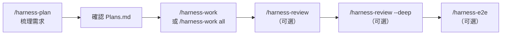

# Claude Code Harness — 自主迴環開發流程

> 本專案的 Harness 開發流程靈感來源於 [claude-code-harness](https://github.com/Chachamaru127/claude-code-harness)，
> 在其概念基礎上針對本專案的三層架構與 BFF 模式進行了客製化實作。

---

## 什麼是 Harness

核心公式：**Agent = Model + Harness**

Harness 是包裹在 LLM 外面的所有基礎設施——迴圈調度、工具呼叫、上下文管理、狀態持久化、錯誤處理、權限護欄。模型提供智慧，Harness 讓智慧落地。

**Harness 不是新技術，是一個閉環（closed-loop）編排概念。** 「寫程式碼 → 跑測試 → 修錯誤」這個迴圈本身就是 harness 在做的事。重點是**用對的工具、在對的時機、做對的事**，而不是把所有能力無差別堆上去——工具太多反而讓模型困惑、降低品質。

**模型越強，Harness 越薄。** 隨著模型能力提升，過去為了補償模型不足而設計的 scaffolding 應該逐步移除——Manus 團隊在六個月內重寫了五次，每次都在刪複雜度。但 Harness 不會完全消失，即使最強的模型仍需要上下文管理、工具執行、狀態持久化與結果驗證。

正確的做法是**隨模型演進持續簡化 Harness**，而非一次設計就永遠不動。

---

## 檔案結構總覽

```
.claude/
├── commands/
│   ├── harness-plan.md                # 任務規劃與 Plans.md 管理
│   ├── harness-work.md                # 任務迴環指揮劇本
│   ├── harness-review.md              # 品質審查（--fix / --deep 可組合）
│   ├── harness-e2e.md                 # 瀏覽器端對端測試
│   └── harness-docs.md                # 文件同步驗證
├── harness/
│   ├── hooks/
│   │   ├── pre-write-check.sh         # PreToolUse：寫入前安全檢查
│   │   ├── pre-compact-check.sh       # PreCompact：壓縮前 WIP 檢查
│   │   └── stop-check.sh              # Stop：結束前 WIP 檢查
│   ├── worker-prompt.md               # Worker 角色指示與架構規範
│   ├── reviewer-prompt.md             # Reviewer 角色指示與 checklist
│   ├── sprint-contract-template.json  # Sprint Contract 空白模板
│   └── contracts/                     # 每個任務的 Sprint Contract（自動生成，不納入版控）
└── settings.json                      # 共享權限與 hook 綁定
```

---

## 指令參照

### /harness-plan — 任務規劃

管理 Plans.md 的任務規劃。

| 參數 | 動作 |
|------|------|
| 無參數 / `create` | 對話式需求梳理（最多 3 問）→ 技術調查 → 產生結構化任務 |
| `add 任務描述` | 快速追加一筆任務到 Plans.md |
| `sync` | 比對 Plans.md 與實際 git 狀態，同步進度 |

create 流程：讀取背景（CLAUDE.md + Plans.md + worker-prompt.md）→ 需求梳理 → Glob/Grep 技術調查 → 產生 `### P{N} — {標題} cc:TODO` 格式任務。任務格式範例見 `Plans.example.md`。

---

### /harness-work — 任務迴環

讀取 Plans.md 中的 `cc:TODO` 任務，自動選擇模式，跑完 Work → Review → Simplify → Docs Sync → Commit 全流程。

**參數：** 無參數（取第一個 TODO）/ 指定編號（如 `P14`）/ `all`（全部 TODO）

**模式選擇：**

| 模式 | 適用情境 | 行為 |
|------|---------|------|
| Solo | 簡單任務、單一檔案 | Lead 自己實作，不 spawn Agent |
| Parallel | 多個獨立任務 | spawn Worker 平行處理，Lead review |
| Breezing | 大量/高複雜度任務 | Worker + Reviewer 三角分離，Lead 不寫程式碼 |

**迴環流程：**

```
cc:TODO → cc:DOING → 生成 Sprint Contract
    → spawn Worker → Worker 回傳
    → spawn Reviewer
        ├─ APPROVE → /simplify → /harness-e2e（條件）→ /harness-docs → /commit-fast → cc:DONE
        └─ REQUEST_CHANGES → 重新 spawn Worker（最多 3 次）→ 再 Review
```

Solo 模式省略 spawn，但 Lead 仍遵守 worker-prompt 規範，自我對照 reviewer checklist 做快速自審。

---

### /harness-review — 品質審查

對現有程式碼做品質審查。支援範圍參數：無參數（全專案）/ `backend` / `frontend` / 指定路徑。

| 模式 | 行為 |
|------|------|
| 無 flag（預設） | 唯讀靜態審查，按 reviewer-prompt.md checklist 逐項掃描 |
| `--fix` | 靜態審查 + Preflight + `/simplify` + 自動修正 critical/major + 文件同步 |
| `--deep` | 靜態審查 + `svelte-check`/`ruff check` 工具驗證 + WS 事件契約交叉比對 + `any` 滲透掃描 |
| `--fix --deep` | 以上全部 |

`--deep` 的範圍參數 `ws` / `any` 可限定只跑特定檢查。

---

### /harness-e2e — 瀏覽器端對端測試

透過 Chrome DevTools MCP 操作真實瀏覽器驗證功能。不修改程式碼。

**前置條件：** `docker-compose up -d` + 後端 `:8000` + 前端 `:5173`

| 套件 | 測試內容 |
|------|---------|
| Auth | 登入、Cookie 設定、頁面導向 |
| Chat | WebSocket 雙使用者即時訊息收發（isolatedContext） |
| Room | 建立/設定/刪除、探索 vs 已加入列表 |
| File | 檔案上傳、訊息顯示、下載 |
| Notification | 未讀標記、點擊已讀 |

已知 UI 互動的 workaround（如 textarea 需 `evaluate_script`、confirm 需 `handle_dialog`）記錄在 `.claude/commands/harness-e2e.md`。

---

### /harness-docs — 文件同步驗證

比對 git diff 與文件內容，找出過時或缺漏的文件區塊。預設唯讀，加 `--fix` 才修改。

**6 個驗證維度：**

| Check | 對象 | 比對方式 |
|-------|------|---------|
| 1. 專案結構樹 | README.md | Glob 實際目錄 vs 文件樹 |
| 2. API 端點表 | README.md | Grep routers vs 表格 |
| 3. C4 元件圖 | c4-architecture.md | Glob 各層檔案 vs 圖中節點 |
| 4. DI 工廠函數 | technical-reference.md | fastapi_integration.py vs 文件範例 |
| 5. 程式碼範例 | technical-reference.md | 實際檔案 vs 文件程式碼區塊 |
| 6. 特色功能 | README.md | 新增/刪除 router/service vs 功能描述 |

根據 git diff 影響的目錄自動判定觸發哪些 Check。`--fix` 可自動修正 Check 1-4（結構性更新），Check 5-6 需人工撰寫。

---

## Worker 規範摘要

完整規範在 `.claude/harness/worker-prompt.md`。

### 後端三層架構

```
Router（app/routers/）→ Service（app/services/）→ Repository（app/repositories/）
```

| 層 | 職責 | 禁止 |
|----|------|------|
| Router | 提取參數 → 呼叫 service → 回傳 response | try/except、直接操作 DB、商業邏輯 |
| Service | 商業邏輯，拋 AppError 子類別 | import HTTPException、直接操作 collection |
| Repository | 資料存取，回傳 None/bool/[] | try/except 攔截 DB 異常、商業邏輯 |

### 前端 BFF 架構

Browser 不直接呼叫 FastAPI。所有 API 走 SvelteKit BFF 代理（`/src/routes/api/`）。Protected route 用 `bffAuthRequest()`，回應用 `createBFFResponse()` 包裝，錯誤用 `toBffErrorResponse()` 處理，前端不存取 token。

### DI 工廠函數

新增 service 時在 `app/core/fastapi_integration.py` 做三件事：加 async 工廠函數 → 加 Depends 別名 → Router 用別名注入（WebSocket handler 用 `await create_X_service()` 直接呼叫）。

### Preflight

```bash
cd backend && ruff check . && ruff format --check .   # lint + format
cd backend && pytest tests/ -v --tb=short -x           # 測試
cd frontend && npm run check:all                        # 型別 + lint
```

---

## Reviewer Checklist 總覽

完整 checklist 在 `.claude/harness/reviewer-prompt.md`。Reviewer 是唯讀子 Agent（只能用 Read、Grep、Glob）。

| 維度 | 項目數 | 檢查重點 |
|------|--------|---------|
| 三層架構違規 | 17 | Router try/except、Service import HTTPException、Repository 商業邏輯 |
| DI 違規 | 4 | 缺工廠函數、缺 Depends 別名、WebSocket 誤用 Depends |
| BFF 架構違規 | 7 | 直呼後端 URL、缺 BFF route、未用 bffAuthRequest |
| 安全 | 8 | secrets、NoSQL injection、XSS、token 洩漏、缺認證 |
| 一致性 | 13 | 授權多入口不一致、業務規則不一致、TOCTOU 競態、非原子寫入 |
| 效能/品質/簡潔性 | 13 | N+1 查詢、缺分頁、命名、測試覆蓋 |

**判決：** 有任何 critical 或 major → REQUEST_CHANGES；只有 minor/recommendation → APPROVE。

---

## Sprint Contract

每個任務開始前由 Lead 自動生成，是 Worker 和 Reviewer 的共同基準。模板在 `.claude/harness/sprint-contract-template.json`。

| 欄位 | 說明 |
|------|------|
| `task_id` / `subject` | 任務編號與標題 |
| `scope` | 影響範圍（backend / frontend / shared） |
| `checks` / `non_goals` | DoD 確認項目 / 明確不做什麼 |
| `runtime_validation` | 驗證指令（ruff、pytest、npm run check:all） |
| `risk_flags` | 風險標記 |
| `architecture_rules` | 三層架構 + BFF + DI pattern（固定值） |
| `affected_files` | 預估修改的檔案，按 models/repos/services/routers/bff/components/tests 分組 |

---

## Plans.md 任務追蹤

Plans.md 位於專案根目錄，是所有任務的唯一來源。格式範例見 `Plans.example.md`。

**狀態機：** `cc:TODO` → `cc:DOING` → `cc:DONE`

- `/harness-work` 啟動時掃描 `cc:TODO`，處理時改為 `cc:DOING`，commit 後改為 `cc:DONE`

---

## 安全防護

透過 `.claude/settings.json` 綁定 3 個 hook：

| Hook 事件 | 腳本 | 行為 |
|-----------|------|------|
| `PreToolUse(Write\|Edit)` | `pre-write-check.sh` | 攔截 .env / node_modules / .git 寫入；掃描硬編碼 secrets（AWS Key、API Key、明文密碼）→ exit 2 攔截 |
| `PreCompact` | `pre-compact-check.sh` | 壓縮前警告 cc:DOING 任務（不攔截） |
| `Stop` | `stop-check.sh` | 結束前警告 cc:DOING 任務（不攔截） |

`settings.json` 同時定義自動放行的操作：git 指令、ruff、pytest、npm run check。完整設定見 `.claude/settings.json`。

---

## 第二意見審查（Cross-Model Review）

用**不同的 AI 模型**對同一份 diff 做獨立審查，消除單一模型偏見。本專案使用 [OpenAI Codex](https://openai.com/index/openai-codex/) 作為第二意見，實測效果不錯，當然任何不同模型都可以（Gemini、Grok 等）。

**不一定要搭配 `/harness-work`，手動做也完全可以。** 最簡單的方式就是把 diff 貼給另一個模型，請它審查。如果發現問題，直接回來問原本的模型「為什麼這個問題沒有在審查中被抓出來」——這個回饋本身就很有價值，能幫助你理解模型的盲點在哪裡。

```
任何 commit / PR 的 diff
    ↓
貼給不同模型審查（Codex、Gemini、Grok...）
    ↓
發現問題 → 回來問原模型為什麼沒審出來 → 修正 harness 或程式碼
```

重點是**交叉審查的思維**，不是特定工具或流程。兩個不同模型各有各的盲點，交叉比對比單一模型更可靠。

---

## 指令間的協作關係

| 指令 | 內部呼叫 | 備註 |
|------|---------|------|
| `/harness-plan` | 無 | Plans.md 管理 |
| `/harness-work` | /simplify, /harness-e2e（條件）, /harness-docs, /commit-fast | 完整迴環 |
| `/harness-review` | 無（`--fix` 時呼叫 /simplify + /commit-fast） | 品質審查 |
| `/harness-e2e` | 無 | 瀏覽器 E2E，也可單獨執行 |
| `/harness-docs` | 無 | 文件同步，也可單獨 `--fix` |

### 典型使用順序



